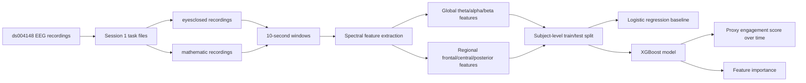
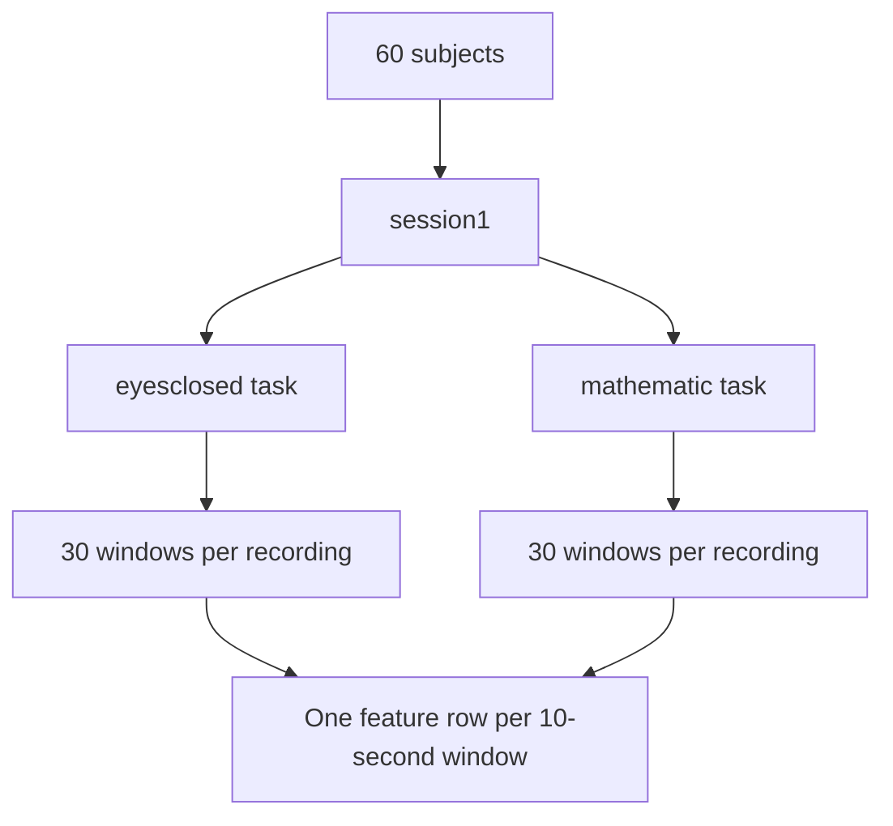
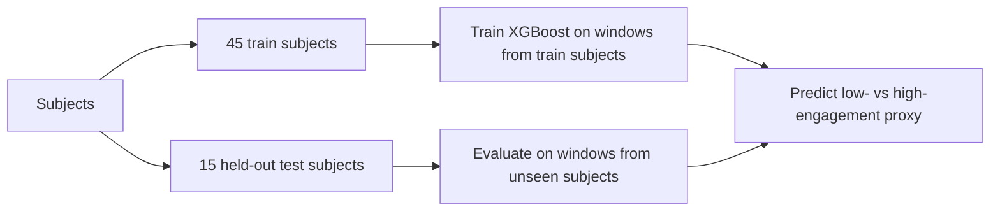

# ds004148 Analysis Diagrams

## Project Pipeline

```mermaid
flowchart LR
    A["ds004148 EEG recordings"] --> B["Session 1 task files"]
    B --> C["eyesclosed recordings"]
    B --> D["mathematic recordings"]
    C --> E["10-second windows"]
    D --> E
    E --> F["Spectral feature extraction"]
    F --> G["Global theta/alpha/beta features"]
    F --> H["Regional frontal/central/posterior features"]
    G --> I["Subject-level train/test split"]
    H --> I
    I --> J["Logistic regression baseline"]
    I --> K["XGBoost model"]
    K --> L["Proxy engagement score over time"]
    K --> M["Feature importance"]
```

## Data Hierarchy

```mermaid
flowchart TD
    A["60 subjects"] --> B["session1"]
    B --> C["eyesclosed task"]
    B --> D["mathematic task"]
    C --> E["30 windows per recording"]
    D --> F["30 windows per recording"]
    E --> G["One feature row per 10-second window"]
    F --> G
```

## Model Evaluation

```mermaid
flowchart LR
    A["Subjects"] --> B["45 train subjects"]
    A --> C["15 held-out test subjects"]
    B --> D["Train XGBoost on windows from train subjects"]
    C --> E["Evaluate on windows from unseen subjects"]
    D --> F["Predict low- vs high-engagement proxy"]
    E --> F
```

## Downstream Use

```mermaid
flowchart LR
    A["New EEG window"] --> B["Extract same 17 features"]
    B --> C["XGBoost predict_proba"]
    C --> D["P(mathematic-like EEG)"]
    D --> E["Proxy engagement score"]
```

