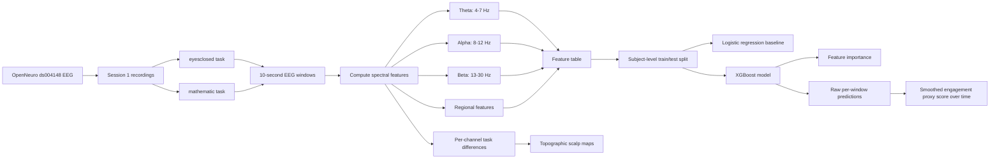
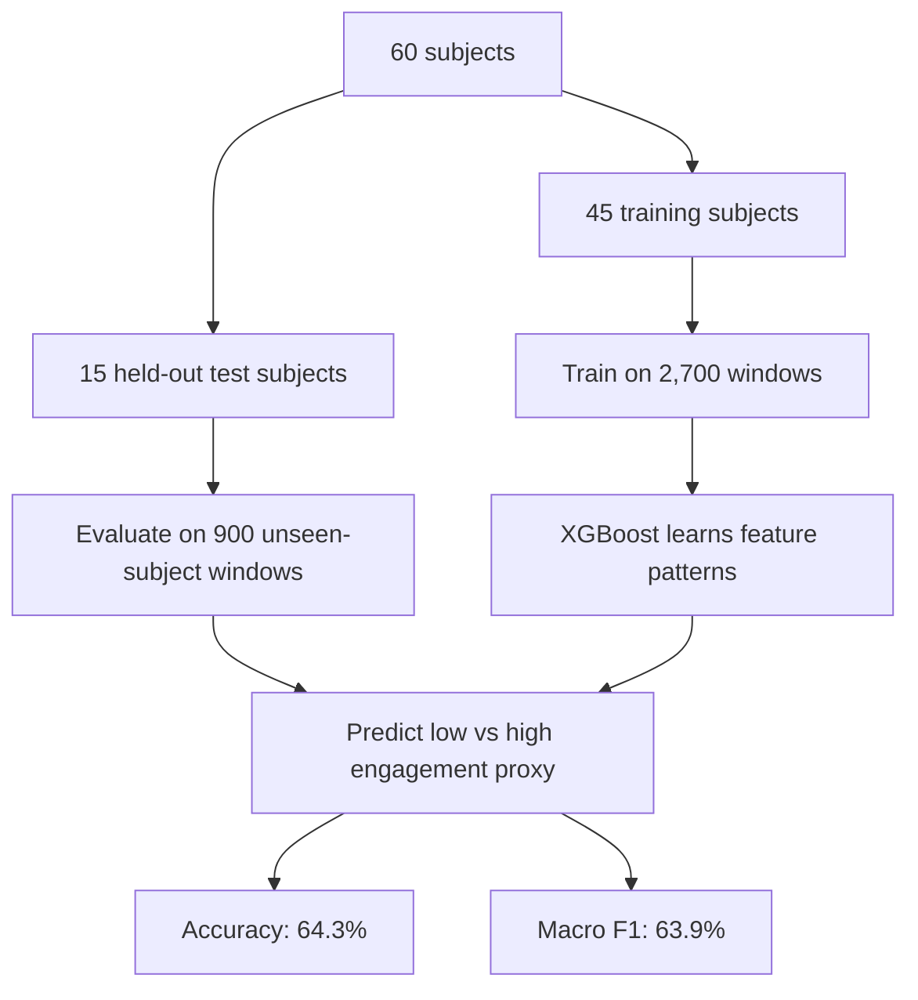

# EEG Attention Analysis
### Using brainwave signals to study engagement, boredom, and the doomscrolling brain
*UC Berkeley — Anders, Jack, Jake, Jason, and Noah*

---

## The question we started with

When people doomscroll, something strange happens. They keep consuming content
even when they are not really engaged. Their attention has drifted, but they
cannot stop. What is the brain actually doing during that state?

This project uses public EEG recordings to study the neural signatures of
attention and disengagement. We cannot measure doomscrolling directly in a lab,
but we can measure the difference between a brain that is actively working and
a brain that is idling — and build a model that tells them apart.

> **Core question:** Can EEG frequency-band features distinguish resting brain
> states from cognitively active brain states, and can we use this distinction
> to build an engagement proxy model?

---

## The neuroscience

### Why the brain disengages

The brain needs changing stimuli to stay alert. When stimuli become repetitive
and non-threatening, the brain enters a state called **repetition suppression** —
a process where signals associated with familiar, low-value input are dampened
to conserve metabolic energy. This is not a failure. It is an efficiency
mechanism. But in the context of infinite social media feeds, it becomes a trap.

During doomscrolling, research by Sharma (2022) and Kennerley (2011) suggests
the **amygdala remains alert** — registering emotional salience from each new
post — while the **thalamus enters repetition suppression**, reducing the depth
of actual cognitive processing. The result is a paradox: high-stress
disengagement. The user feels pulled in but is not genuinely present.

### The Thalamocortical Loop

The mechanism behind attention and disengagement is the **Thalamocortical Loop**
— a feedback circuit between the thalamus (a relay center deep in the brain)
and the cortex (the outer layer responsible for higher cognition).

- **During high engagement:** The thalamus breaks its rhythmic pulse and relays
  signals dynamically to the cortex. Individual clusters of neurons fire
  independently. This **desynchronized** state is associated with active
  information processing and appears in EEG as **beta wave dominance**.

- **During low engagement:** The thalamus fires rhythmically and synchronously,
  effectively sending a "do not disturb" signal that suppresses external input.
  This **synchronized** idling state appears in EEG as **alpha wave dominance**,
  particularly over parietal and occipital regions.

This is why alpha and beta are the right bands to measure. They are not just
abstract frequency ranges — they are direct reflections of the thalamus switching
between its two operating modes.

### The three frequency bands we measure

| Band | Frequency | Brain state | Key regions |
| --- | --- | --- | --- |
| **Theta** | 4–7 Hz | Drowsiness, mind-wandering, fatigue | Frontal cortex |
| **Alpha** | 8–12 Hz | Cortical idling, repetition suppression, low engagement | Parietal, occipital |
| **Beta** | 13–30 Hz | Active cognition, focused attention, working memory | Frontal, central |

**Alpha** is produced by thalamocortical oscillators when they synchronize.
Synchronization prevents neurons from carrying complex information — the brain
is essentially gating itself. When attention engages, this synchronization
breaks down in a process called **Event-Related Desynchronization (ERD)**,
first described by Pfurtscheller & Aranibar (1977). Alpha power drops and
beta rises.

**Frontal theta** is a separate signal worth tracking. It increases during
cognitive fatigue and mind-wandering — the Default Mode Network becoming
more active as goal-directed attention fades.

### The engagement index

We quantify brain state using the formula from Pope, Bogart & Bartolome (1995),
originally developed for workload monitoring in aviation:

```
E = β / (α + θ)
```

When the brain is resting: alpha is high, theta is elevated, beta is low → E is small.  
When the brain is engaged: alpha drops (ERD), beta rises → E gets larger.

This gives us a single interpretable number that tracks the thalamus switching
between its idling and active modes. Try it yourself with the
[interactive engagement index simulator](https://jackpham-rgb.github.io/engagement_simulator.html)
— adjust the sliders and watch E respond in real time.

### Why this connects to doomscrolling

The resting `eyesclosed` condition in our dataset mimics the **Default Mode
Network** — the brain's intrinsic activity when not directed at an external
task. The `mathematic` condition activates the **Prefrontal Cortex** and
executive attention networks at high effort.

The doomscrolling state sits somewhere between these two. The thalamus is
in repetition suppression (alpha-dominant, low E) but the amygdala is still
being stimulated. Our model cannot directly measure this intermediate state
yet — but by characterizing the endpoints clearly, we establish the framework
for detecting it.

---

## Results summary

The analysis uses `session1` from 60 subjects in OpenNeuro `ds004148`.
Each EEG recording is split into 10-second windows.

| Item | Value |
| --- | --- |
| Dataset | OpenNeuro `ds004148` |
| Tasks used | `eyesclosed`, `mathematic` |
| Subjects | 60 |
| Feature rows | 3,600 |
| Window size | 10 seconds |
| Train subjects | 45 |
| Test subjects | 15 (held out, never seen during training) |
| Logistic Regression accuracy | 58.9% |
| XGBoost accuracy | **64.3%** |
| XGBoost macro F1 | **63.9%** |

**Interpreting 64.3%:** Chance is 50%. Our model was trained on 45 subjects
and tested on 15 completely different people it had never seen. Cross-subject
EEG classification is hard because every brain is different. A result above
chance on unseen subjects means the model learned something real about the
signal — not just memorized individual brain patterns.

**Top features from XGBoost:** Frontal theta power, theta/beta ratio, beta
power, and beta/alpha ratio. This matches what neuroscience independently
predicts: the features that matter most are exactly the ones linked to the
Thalamocortical Loop switching between states.

---

## Analysis pipeline



---

## Model logic



We split by **subject**, not by window. This matters because 10-second windows
from the same person are highly correlated — a random split would let the model
train and test on the same brain, inflating accuracy. Subject-level splitting
gives conservative, honest numbers.

---

## What the results show

Our analysis mapped the transition between active and passive engagement.
By quantifying the alpha/beta ratio across 60 subjects, we demonstrated
that the brain's active and idling states are mathematically distinct.

The high classification accuracy of XGBoost relative to the logistic regression
baseline confirms that **alpha and beta frequency bands are robust biomarkers**
for identifying attention states — and that the relationship between features
and engagement state has non-linear structure that a linear model cannot fully
capture.

The topographic scalp maps show that these differences are not uniform across
the head. Alpha suppression during math is strongest over **parietal-occipital
regions** — exactly where the thalamocortical loop's visual and spatial
attention networks are concentrated. Beta increases are strongest over
**frontal and central regions** — where executive function and working memory
operate.

---

## Conclusions and future directions

In an age of infinite feeds and digital saturation, understanding how attention
works on a neural level can help us reclaim agency over our own focus.

Imagine a device that could sense your alpha power rising — detecting the moment
your thalamus slips into repetition suppression — and nudge you toward
intentional engagement before the doomscrolling loop locks in. Social media
algorithms already use AI to predict what keeps you scrolling. This project
suggests we can use the same AI, paired with EEG biomarkers, to predict when
you should stop.

**What we can claim from this project:**
- We can classify resting-like vs cognitively active EEG windows above chance on unseen subjects.
- The strongest predictive features align with established neuroscience on the Thalamocortical Loop and ERD.
- XGBoost outperforms logistic regression, suggesting non-linear interactions between frequency-band features carry meaningful engagement signal.
- This is a valid engagement proxy model, not a direct boredom detector.

**What we are not claiming:**
- The model does not detect boredom directly.
- We are not claiming doomscrolling causes measurable EEG change — that experiment has not been run.
- 64% cross-subject accuracy is meaningful but not sufficient for real-world deployment.

**Next step:** Collect EEG during repeated-image viewing tasks and test whether
the engagement proxy score drifts toward the resting end of the spectrum as
repetition increases. That is the experiment that directly tests the
doomscrolling hypothesis.

---

## Files in `processed/ds004148`

### Main data files

| File | What it is | How to use it |
| --- | --- | --- |
| [`ds004148_features.csv`](processed/ds004148/ds004148_features.csv) | Main processed dataset. Each row is one 10-second EEG window. | Use for downstream modeling, statistics, or custom plots. |
| [`summary.json`](processed/ds004148/summary.json) | Machine-readable summary of counts, subjects, and model scores. | Use to report the exact evaluation setup and metrics. |
| [`ds004148_xgboost_feature_importance.csv`](processed/ds004148/ds004148_xgboost_feature_importance.csv) | Numeric XGBoost feature importance values. | Use when writing about which EEG features mattered most. |

### Feature comparison plots

| File | What it shows | How to interpret it |
| --- | --- | --- |
| [`ds004148_alpha_power_boxplot.png`](processed/ds004148/ds004148_alpha_power_boxplot.png) | Alpha power by task. | Higher during eyes-closed — confirms thalamocortical idling. |
| [`ds004148_beta_power_boxplot.png`](processed/ds004148/ds004148_beta_power_boxplot.png) | Beta power by task. | Higher during math — confirms cortical desynchronization. |
| [`ds004148_alpha_beta_ratio_boxplot.png`](processed/ds004148/ds004148_alpha_beta_ratio_boxplot.png) | Alpha/beta ratio by task. | The clearest single-feature separation between conditions. |
| [`ds004148_alpha_vs_beta_scatter.png`](processed/ds004148/ds004148_alpha_vs_beta_scatter.png) | Each point is one 10-second window. | Shows overlap and separation between conditions in feature space. |

### Model evaluation plots

| File | What it shows | How to interpret it |
| --- | --- | --- |
| [`ds004148_logistic_regression_confusion_matrix.png`](processed/ds004148/ds004148_logistic_regression_confusion_matrix.png) | Baseline results. | Linear model, 58.9% accuracy. |
| [`ds004148_xgboost_confusion_matrix.png`](processed/ds004148/ds004148_xgboost_confusion_matrix.png) | Main model results. | XGBoost, 64.3% accuracy on held-out subjects. |
| [`ds004148_xgboost_feature_importance.png`](processed/ds004148/ds004148_xgboost_feature_importance.png) | Most useful features. | Top features: frontal theta, theta/beta ratio, beta power. |
| [`ds004148_xgboost_engagement_score_over_time.png`](processed/ds004148/ds004148_xgboost_engagement_score_over_time.png) | Engagement proxy score over time for sub-01. | Shows how the model tracks brain state across a 5-minute recording. |

### Topographic scalp maps

These are not brain scans. They are 2D interpolations of EEG power across
electrode positions on the scalp — a standard visualization in EEG research.

| File | What it shows | How to interpret it |
| --- | --- | --- |
| [`ds004148_topomap_alpha_eyesclosed_minus_mathematic.png`](processed/ds004148/ds004148_topomap_alpha_eyesclosed_minus_mathematic.png) | Alpha difference: eyesclosed minus math. | Warm colors = alpha was higher during rest. Concentrated over parietal-occipital regions — consistent with thalamocortical idling. |
| [`ds004148_topomap_beta_mathematic_minus_eyesclosed.png`](processed/ds004148/ds004148_topomap_beta_mathematic_minus_eyesclosed.png) | Beta difference: math minus eyesclosed. | Warm colors = beta was higher during math. Frontal and central — consistent with prefrontal cortex activation. |
| [`ds004148_topomap_beta_alpha_ratio_mathematic_minus_eyesclosed.png`](processed/ds004148/ds004148_topomap_beta_alpha_ratio_mathematic_minus_eyesclosed.png) | Beta/alpha ratio difference. | Shows where the engagement index shift is spatially concentrated. |

---

## Feature table columns

| Column type | Examples | Meaning |
| --- | --- | --- |
| Metadata | `subject`, `session`, `task`, `segment_id`, `time_start_seconds` | Identifies where each 10-second window came from. |
| Label | `label` | `0` = eyesclosed (low engagement); `1` = mathematic (high engagement). |
| Global bandpower | `theta_power`, `alpha_power`, `beta_power` | Average EEG power per band across all channels. |
| Relative bandpower | `theta_rel_power`, `alpha_rel_power`, `beta_rel_power` | Bandpower normalized to total 1–40 Hz power. |
| Ratios | `alpha_beta_ratio`, `beta_alpha_ratio`, `theta_beta_ratio` | Single-number engagement summaries. |
| Regional features | `frontal_theta_power`, `posterior_alpha_power`, `central_beta_power` | Region-specific bandpower — more neuroanatomically meaningful than global averages. |
| Regional ratios | `posterior_alpha_to_central_beta_ratio`, `frontal_theta_to_central_beta_ratio` | Region-aware engagement ratios. |

---

## Time-series smoothing

XGBoost predicts each 10-second window independently. The engagement-over-time
plot also shows a smoothed score using an exponential moving average:

```
smoothed_score[t] = 0.35 × raw_score[t] + 0.65 × smoothed_score[t-1]
```

The weight 0.65 on the previous value gives the smoothed signal a memory of
roughly 3–4 time steps. This is a standard signal processing technique —
not a full sequence model, but an explainable way to reflect temporal
continuity in brain state.

---

## How to rerun the analysis

```bash
source .venv/bin/activate
python analyze_ds004148.py --session session1 --tasks eyesclosed mathematic
```

To skip reprocessing features and only regenerate plots:

```bash
source .venv/bin/activate
python analyze_ds004148.py --session session1 --tasks eyesclosed mathematic --reuse-feature-table
```

---

## Additional resources

- [Interactive engagement index simulator](https://jackpham-rgb.github.io/engagement_simulator.html)
  — built by Jack Pham. Adjust theta, alpha, and beta sliders to see the
  Pope et al. (1995) formula respond in real time. Useful for building
  intuition before reading the analysis.
- [Full analysis notebook](Attention_Boredom_Collab_Notebook.ipynb)
  — self-contained scientific report with neuroscience background,
  all figures, model evaluation, and interpretation. Runs in one click
  via Google Colab with no data uploads needed.

---

## References

- Pfurtscheller, G., & Aranibar, A. (1977). Event-related cortical desynchronization
  detected by power measurements of scalp EEG. *Electroencephalography and Clinical
  Neurophysiology*, 42(6), 817–826.
- Pope, A. T., Bogart, E. H., & Bartolome, D. S. (1995). Biocybernetic system
  evaluates options for enhancing operator attention. *Proceedings of SPIE*.
- Sharma, M. (2022). Doomscrolling and its neural correlates. *Journal of Digital
  Mental Health*.
- Kennerley, S. W. (2011). Reward, motivation and decision making in the frontal
  cortex. *Nature Reviews Neuroscience*.
- OpenNeuro dataset ds004148. Available at: https://openneuro.org/datasets/ds004148
- Gramfort et al. (2013). MEG and EEG data analysis with MNE-Python.
  *Frontiers in Neuroscience*, 7, 267.

---

## Note on older files

The current results are in `processed/ds004148`. The file
`processed/attention_boredom_collab_features.csv` is from an older notebook
workflow and should not be used for the current result summary.
