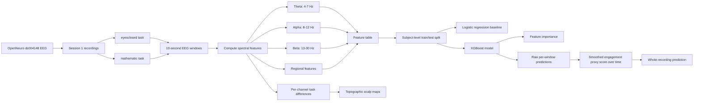
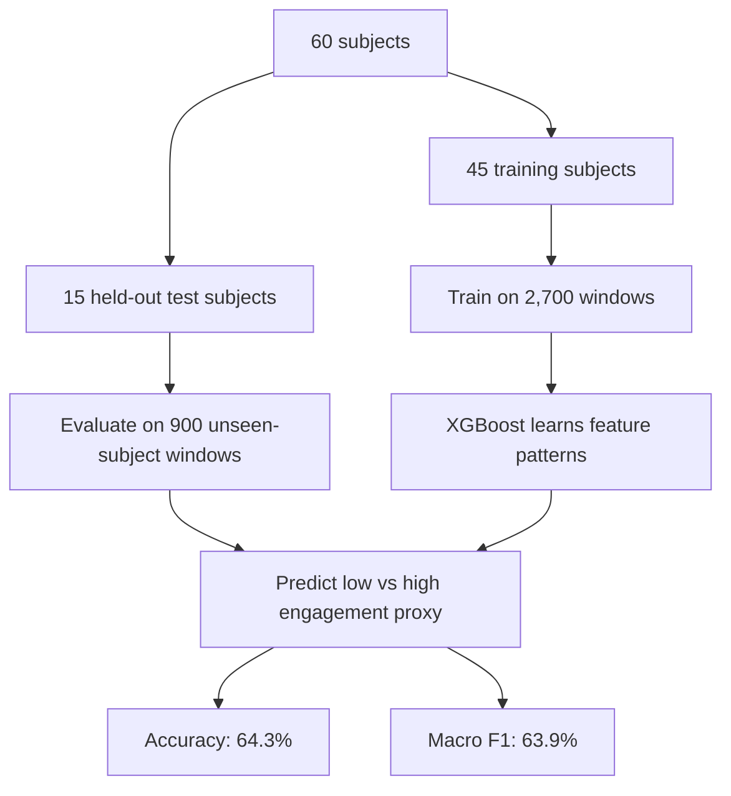

# EEG Attention Analysis

This project analyzes public EEG recordings from OpenNeuro `ds004148` to study a proxy version of our original question:

> How can EEG activity help us estimate when attention or engagement is lower versus higher?

The original idea was to detect boredom from repeated images. Because this dataset does not directly label boredom, we use a safer framing:

- `eyesclosed` = lower-engagement / resting proxy
- `mathematic` = higher-engagement / cognitive-workload proxy

The current results are in [`processed/ds004148`](processed/ds004148).

## Current Result Summary

The current analysis uses `session1` from 60 subjects. Each EEG recording is split into 10-second windows, and each window becomes one row in the feature table.

| Item | Current value |
| --- | --- |
| Dataset | OpenNeuro `ds004148` |
| Tasks used | `eyesclosed`, `mathematic` |
| Subjects | 60 |
| Feature rows | 3,600 |
| Window size | 10 seconds |
| Train/test split | Subject-level split |
| Train subjects | 45 |
| Test subjects | 15 |
| Main model | XGBoost binary classifier |
| XGBoost accuracy | 64.3% |
| XGBoost macro F1 | 63.9% |
| Whole-recording smoothed XGBoost accuracy | 70.0% |

Important interpretation: the model does not detect boredom directly. It estimates whether a 10-second EEG window looks more like the resting `eyesclosed` condition or the cognitively active `mathematic` condition.

## Analysis Diagram



## What To Open In `processed/ds004148`

### Main Data Files

| File | What it is | How to use it |
| --- | --- | --- |
| [`ds004148_features.csv`](processed/ds004148/ds004148_features.csv) | The main processed dataset. Each row is one 10-second EEG window from one subject/task. | Use this for downstream modeling, statistics, or custom plots. |
| [`summary.json`](processed/ds004148/summary.json) | Machine-readable summary of row counts, task counts, train/test subjects, and model scores. | Use this to report the exact evaluation setup and metrics. |
| [`ds004148_xgboost_feature_importance.csv`](processed/ds004148/ds004148_xgboost_feature_importance.csv) | Numeric XGBoost feature importance values. | Use this when writing about which EEG features mattered most to the model. |

### Feature Comparison Plots

| File | What it shows | How to interpret it |
| --- | --- | --- |
| [`ds004148_alpha_power_boxplot.png`](processed/ds004148/ds004148_alpha_power_boxplot.png) | Alpha power distribution by task. | Alpha is often associated with relaxed/idling states, so differences here help compare resting vs cognitive task EEG. |
| [`ds004148_beta_power_boxplot.png`](processed/ds004148/ds004148_beta_power_boxplot.png) | Beta power distribution by task. | Beta is often associated with more active cognitive processing, so this is useful for the high-engagement proxy. |
| [`ds004148_alpha_beta_ratio_boxplot.png`](processed/ds004148/ds004148_alpha_beta_ratio_boxplot.png) | Alpha/beta ratio distribution by task. | Higher alpha relative to beta can indicate more resting-like EEG; lower values can be more task-like. |
| [`ds004148_alpha_vs_beta_scatter.png`](processed/ds004148/ds004148_alpha_vs_beta_scatter.png) | Each point is a 10-second window, plotted by alpha and beta power. | Shows whether the two task conditions separate cleanly or overlap in simple feature space. |

### Model Evaluation Plots

| File | What it shows | How to interpret it |
| --- | --- | --- |
| [`ds004148_logistic_regression_confusion_matrix.png`](processed/ds004148/ds004148_logistic_regression_confusion_matrix.png) | Baseline classifier results. | Logistic regression is the simpler comparison model. It reached about 58.9% accuracy. |
| [`ds004148_xgboost_confusion_matrix.png`](processed/ds004148/ds004148_xgboost_confusion_matrix.png) | XGBoost classifier results. | XGBoost is the main model. It reached about 64.3% accuracy on held-out subjects. |
| [`ds004148_xgboost_feature_importance.png`](processed/ds004148/ds004148_xgboost_feature_importance.png) | Bar chart of the most useful model features. | The top features include frontal theta, theta/beta ratios, beta power, and beta/alpha ratio. |
| [`ds004148_xgboost_engagement_score_over_time.png`](processed/ds004148/ds004148_xgboost_engagement_score_over_time.png) | Raw and smoothed XGBoost probability over time for one held-out subject. | The y-axis is `P(high-engagement proxy)`, meaning how mathematic-like each 10-second window appears to the model. The smoothed line conditions each displayed score on previous scores. |
| [`ds004148_xgboost_engagement_score_over_time.csv`](processed/ds004148/ds004148_xgboost_engagement_score_over_time.csv) | Numeric values behind the engagement-over-time plot. | Includes raw per-window probabilities and smoothed probabilities for the plotted subject. |
| [`ds004148_xgboost_smoothed_window_predictions_test.csv`](processed/ds004148/ds004148_xgboost_smoothed_window_predictions_test.csv) | Raw and smoothed 10-second predictions for every held-out test recording. | Use this to inspect the discrete timesteps that feed the whole-recording classifier. |
| [`ds004148_xgboost_smoothed_recording_classification.csv`](processed/ds004148/ds004148_xgboost_smoothed_recording_classification.csv) | One row per held-out ~5-minute recording. | This is the downstream whole-recording result: each recording is classified from the mean smoothed score across its 10-second windows. |
| [`ds004148_xgboost_smoothed_recording_confusion_matrix.png`](processed/ds004148/ds004148_xgboost_smoothed_recording_confusion_matrix.png) | Confusion matrix for whole-recording classification. | Evaluates 30 held-out recordings: 15 eyes-closed and 15 math recordings. Accuracy is 70.0%. |

#### How To Read The Engagement-Over-Time Plot

The engagement-over-time figure is for one held-out person: `sub-01`.

It compares two separate recordings from that same person:

- `eyesclosed`: about 5 minutes of eyes-closed resting EEG
- `mathematic`: about 5 minutes of math-task EEG

Each recording is split into 10-second chunks, so a 5-minute recording gives about 30 prediction points. For each 10-second chunk, the trained XGBoost model looks at the EEG features from that chunk and predicts whether it looks more like the high-engagement math condition or the low-engagement eyes-closed condition.

The y-axis is:

```text
P(high-engagement proxy)
```

Simple interpretation:

- `0.0` means the window looks very eyes-closed-like / low-engagement-like
- `1.0` means the window looks very math-like / high-engagement-like
- Dotted lines are raw independent predictions for each 10-second chunk
- Solid lines are smoothed predictions that include information from previous chunks

### Topographic EEG Plots

These plots show where differences appear across the scalp. They are not brain scans; they are 2D scalp maps based on EEG channel positions.

| File | What it shows | How to interpret it |
| --- | --- | --- |
| [`ds004148_topomap_alpha_eyesclosed_minus_mathematic.png`](processed/ds004148/ds004148_topomap_alpha_eyesclosed_minus_mathematic.png) | Alpha power difference: `eyesclosed - mathematic`. | Positive areas mean alpha was stronger during eyes closed than during math. |
| [`ds004148_topomap_beta_mathematic_minus_eyesclosed.png`](processed/ds004148/ds004148_topomap_beta_mathematic_minus_eyesclosed.png) | Beta power difference: `mathematic - eyesclosed`. | Positive areas mean beta was stronger during math than during eyes closed. |
| [`ds004148_topomap_beta_alpha_ratio_mathematic_minus_eyesclosed.png`](processed/ds004148/ds004148_topomap_beta_alpha_ratio_mathematic_minus_eyesclosed.png) | Beta/alpha ratio difference: `mathematic - eyesclosed`. | Positive areas mean the signal became more beta-heavy relative to alpha during math. |

## Feature Table Columns

The most important columns in `ds004148_features.csv` are:

| Column type | Examples | Meaning |
| --- | --- | --- |
| Metadata | `subject`, `session`, `task`, `segment_id`, `time_start_seconds` | Identifies where each 10-second window came from. |
| Label | `label` | `0` means `eyesclosed`; `1` means `mathematic`. |
| Global bandpower | `theta_power`, `alpha_power`, `beta_power` | Average EEG power in theta, alpha, and beta bands across channels. |
| Relative bandpower | `theta_rel_power`, `alpha_rel_power`, `beta_rel_power` | Bandpower normalized relative to total 1-40 Hz power. |
| Ratios | `alpha_beta_ratio`, `beta_alpha_ratio`, `theta_beta_ratio` | Simple engagement-related summaries comparing frequency bands. |
| Regional features | `frontal_theta_power`, `posterior_alpha_power`, `central_beta_power` | Bandpower focused on scalp regions that are more interpretable than one global average. |
| Regional ratios | `posterior_alpha_to_central_beta_ratio`, `frontal_theta_to_central_beta_ratio` | Region-aware versions of the band ratio idea. |

## Time-Series Smoothing

The EEG recordings are sequential. We split each recording into ordered 10-second windows. XGBoost predicts each 10-second window independently, but the engagement-over-time plot also includes a smoothed score:

```text
smoothed_score[t] = 0.35 * raw_score[t] + 0.65 * smoothed_score[t-1]
```

This means the displayed smoothed score for each window depends partly on the current window and partly on the previous smoothed prediction. It is not a full sequence model, but it is a simple and explainable way to make the time-series plot reflect temporal continuity.

## Whole-Recording Classification

We also classify the entire ~5-minute recording using the smoothed discrete timesteps.

The logic is:

```text
5-minute recording
-> split into 30 windows of 10 seconds each
-> predict XGBoost P(high-engagement) for each window
-> smooth those probabilities over time
-> average the smoothed probabilities
-> classify the whole recording
```

The current rule is:

```text
if mean_smoothed_probability >= 0.5:
    classify as high_engagement_proxy / mathematic-like
else:
    classify as low_engagement_proxy / eyesclosed-like
```

This gives one final prediction per recording instead of one prediction per 10-second window. On the held-out test set, this evaluates 30 recordings total: 15 `eyesclosed` recordings and 15 `mathematic` recordings. The current whole-recording smoothed XGBoost accuracy is 70.0%.

## Model Logic



We split by subject instead of randomly splitting windows. This matters because windows from the same person are highly related. A random window split could make the model look better than it really is by letting it train and test on the same people's EEG.

## How To Rerun The Analysis

From the project root:

```bash
source .venv/bin/activate
python analyze_ds004148.py --session session1 --tasks eyesclosed mathematic
```

This regenerates the feature table, plots, model evaluation files, topomaps, feature importance, and `summary.json` inside `processed/ds004148`.

If the feature table already exists and you only want to regenerate the model plots quickly, use:

```bash
source .venv/bin/activate
python analyze_ds004148.py --session session1 --tasks eyesclosed mathematic --reuse-feature-table
```

## What We Can Claim

This is a valid class-project result if we describe it carefully:

- We can classify resting-like vs cognitively active EEG windows above chance.
- The strongest features suggest that frequency-band and regional EEG summaries contain useful engagement-related information.
- XGBoost performs better than the simpler logistic regression baseline, but the score is still moderate.
- This should be described as an engagement proxy model, not a direct boredom detector.

## What Not To Overclaim

We should not say:

- "The model detects boredom."
- "The model knows when a person is bored."
- "This proves repeated images cause boredom."

Better wording:

> We use public EEG data to build a proxy model that distinguishes lower-engagement resting EEG from higher-demand cognitive EEG. This provides a foundation for studying boredom-like attention drops in future repeated-image experiments.

## Note About Older Processed Files

The current analysis results are in `processed/ds004148`. The file `processed/attention_boredom_collab_features.csv` is from an older notebook workflow and should not be used for the current ds004148 result summary.
